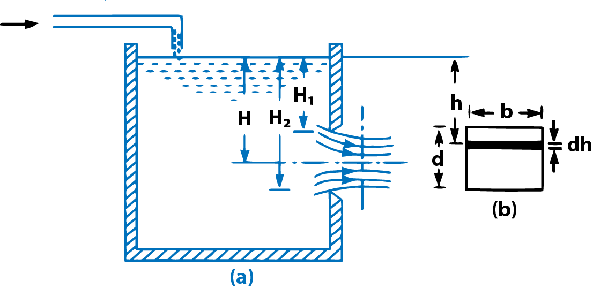
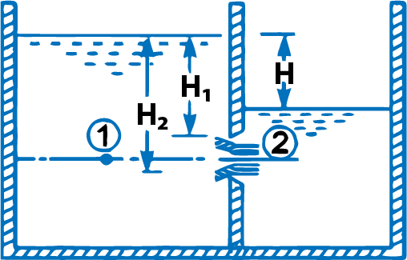
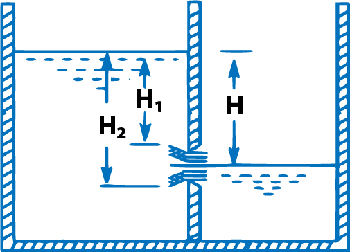
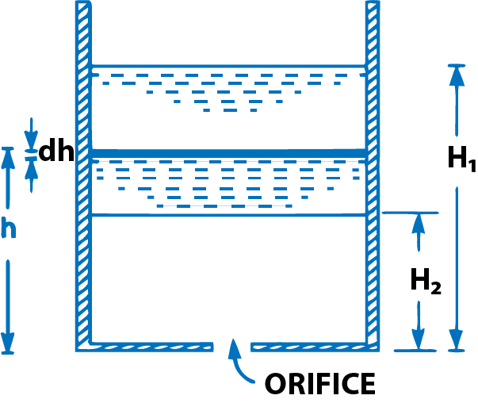

<h2>Discharge Through Large Rectangular Orifice </h2>

Consider a large rectangular orifice in one side of the tank discharging freely into atmosphere under a contant head. H as shown in fig. 1.

Let

&emsp; H1 = height of liquid above top edge of orifice  
&emsp; H2 = height of liquid above bottom edge of orifice  
&emsp; b = breadth of orifice  
&emsp; d = depth of orifice = H2-H1  
&emsp; Cd = co-efficient of discharge.  

Consider an elementary horizontal strip of depth ‘dh' at a depth of ‘h' below the free surface of the liquid in the tank as shown in Fig.1 (b).

Fig. 1  Large rectangular orifice

 

$$ \therefore \ \ \ \ Area \ of \ strip  = \sqrt{b \times dh} $$

and theoretical velocity of water through strip 

$$ = \sqrt{2gh} $$

 &therefore; Discharge through elementry strip is given 

$$ dQ = C_d \times Area \ of \ strip \times Velocity $$
$$ = C_d \times b \times dh \times \sqrt{2gh} = C_db \times \sqrt{2gh} \ dh $$

 By integrating above eqution between the limits H1 and H2, the total discharge through the whole orifice is obtained 

$$ \therefore \ \ \ \ Q = \int_{H_1}^{H_2} C_d \times b \times \sqrt{2gh} \ \ dh $$

$$ =  C_d \times b \times \sqrt{2g} \int_{H_1}^{H_2} h \ dh = C_d \times b \times \sqrt{2g}\left[ \frac{h^{3/2}}{3/2} \right]_{H_1}^{H_2} $$

$$ \frac{2}{3}C_d \times b \times \sqrt{2g} \ [ H_2^{3/2} - H_1^{3/2}] \ \ \ \ ...(a) $$

 

<h2>Discharge Through Large Rectangular Orifice</h2>

Fully sub-merged orifice is one which has its whole of the outlet side sub-merged under liquid so that it discharges a jet of liquid into the liquid of the same kind. It is also called totally drowned orifice. Fig. 7.8 shows the fully sub-merged orifice. Consider two points (1) and (2), point 1 being in the reservoir on the upstream side of the orifice and point 2 being at the vena-contracta as shown in Fig. 2.

Fig. 2  Fully submerged orifice

 

Let

&emsp; H1 = Height of water above the top of the orifice on the upstream side,  
&emsp; H2 = Height of water above the bottom of the orifice,   
&emsp; H = Difference in water level,  
&emsp; b = Width of orifice,  
&emsp; Cd = Co-efficient of discharge.  
 

 d Height of water above the centre of orifice on upstream side 

$$ = H_1 + \frac{H_2 - H_1}{2} = \frac{H_1 + H_2}{2} \ \ \ \ ...(i) $$

 Height of water above the center of orifice on downside side 

$$ = \frac{H_2 - H_1}{2} - H  \ \ \ \ \ \ ...(ii)$$

 Applying Bernoulli's eqaution at (1) and (2), we get 

$$ \frac{p_1}{\rho g}+\frac{V_1^2}{2 g}=\frac{p_2}{\rho g}+\frac{V_2^2}{2 g} $$

$$\frac{p_1}{\rho g}=\frac{H_1+H_2}{2},\  \frac{p_2}{\rho g}=\frac{H_1+H_2}{2}-H \ and \ V_1 is \ negligible $$

$$\therefore \ \ \ \  \frac{H_1+H_2}{2}+0=\frac{H_1+H_2}{2}-H+\frac{V_2^2}{2 g}$$

$$ \therefore \ \ \ \ \ \frac{V_2^2}{2g} = H $$

$$ \therefore \ \ \ \ \ V_2 = \sqrt{2gH} $$

 Area of orifice => Cd x Area x Velocity  

$$ = C_d \times b\left(H_2-H_1\right) \times \sqrt{2 g H}$$

$$ Q = C_d \times b\left(H_2-H_1\right) \times \sqrt{2 g H} \ \ \ \ \ ...(iii)$$

 

<h2>Discharge Through Patially Submerged Orifice</h2>

 Partially sub-merged orifice is one which has its outlet side partially sub-merged under liquid as shown in Fig. 3. It is also known as partially drowned orifice. Thus the partially sub-merged orifice has two portions. The upper portion behaves as an orifice discharging free while the lower portion behaves as a sub-merged orifice. Only a large orifice can behave as a partially sub-merged orifice. The total discharge Q through partially sub-merged orifice is equal to the discharges through free and the sub-merged portions.

Fig. 3  Partially submerged orifice orifice

 

Discharge through the submerged portion is given by the equation (iii)

$$Q_1=C_d \times b \times\left(H_2-H\right) \times \sqrt{2 g H}$$

Discharge through the free portions is given by equation (a) as: 

$$Q_2=\frac{2}{3} C_d \times b \times \sqrt{2 g}\left[H_2^{3 / 2}-H_1^{3 / 2}\right]$$

$$ Total \ Discharge \ \ \ \ \ \ \ Q = Q_1 + Q_2 $$

$$=C_d \times b \times\left(H_2-H\right) \times \sqrt{2 g H} +\frac{2}{3} C_d \times b \times \sqrt{2 g}\left[H_2^{3 / 2}-H^{3 / 2}\right] \ \ \ldots(iv)$$

 

<h2>Time Of Emptying A Tank An Orifice At Its Bottom</h2>

 
Consider a tank containing some liquid upto a height of H1. Let an orifice is fitted at the bottom of the tank. It is required to find the time for the liquid surface to fall from the height H, to a height H2. 

Fig. 4

 

Let

&emsp; A = Area of the tank  
&emsp; a = Area of the orifice  
&emsp; H1 = Initial height of the liquid  
&emsp; H2 = Final height of the liquid  
&emsp; T = Time in seconds for the liquid to fall from H1 to H2.  

Let at any time, the height of liquid from orifice is h and let the liquid surface fall by a small height dh in time dT. Then

Volume of liquid leaving the tank in time, dT = A x dh

also theoretical velocity through orifice

$$ = \sqrt{2gh} $$

&therefore; Discharge through orifice/sec

$$ dQ = C_d \times Area \ of \ orifice \times Theoretical \ velocity  =C_d \cdot a \cdot \sqrt{2 g h} $$

&therefore; Discharge through orifice in time interval

$$d T=C_d \cdot a \cdot \sqrt{2 g h} \cdot d T$$

As the vloume of liquid leaving the tank is equal to the volume of liquid flowing through orifice in time dT, we have

$$ A(-dh) = C_d . a. \sqrt{2gH}.dT $$

-ve sign is inserted because with the increase of time, head on orifice decreases

$$ A(-dh) = C_d . a. \sqrt{2gH}.dT \  \ or \ \ dT = \frac{-A dh}{C_d.a.\sqrt{2gH}} = \frac{-A (h)^{-1/2}}{C_d.a.\sqrt{2g}}dh  $$

By integrating the above eqautions between the limits H1 and H2 the total, T is obtained as

$$ \int_{0}^{T} = \int_{H_1}^{H_2} \frac{-A (h)^{-1/2}}{C_d.a.\sqrt{2g}}dh = \frac{-A}{C_d.a.\sqrt{2g}} \int_{H_1}^{H_2} h^{-1/2} \ \ dh  $$

Or

$$ T = \frac{-A}{C_d.a. \sqrt{2g}} \left[ \frac{h^{-\frac{1}{2}+1}}{-\frac{1}{2} + 1} \right]_{H_1}^{H_2}  = \frac{-A}{C_d.a.\sqrt{2g}} \left[ \frac{\sqrt{h}}{\frac{1}{2}} \right]_{H_1}^{H_2} $$

$$ \frac{-2A}{C_d.a.\sqrt{2g}}[\sqrt{H_2} - \sqrt{H_1}] = \frac{2A[\sqrt{H_2} - \sqrt{H_1}]}{C_d.a.\sqrt{2g}} $$

For emptying the tank completely, H2 = 0 and hence

$$ T = \frac{2A \sqrt{H_1}}{C_d.a.\sqrt{2g}} $$

